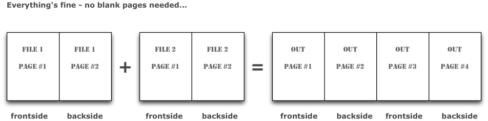
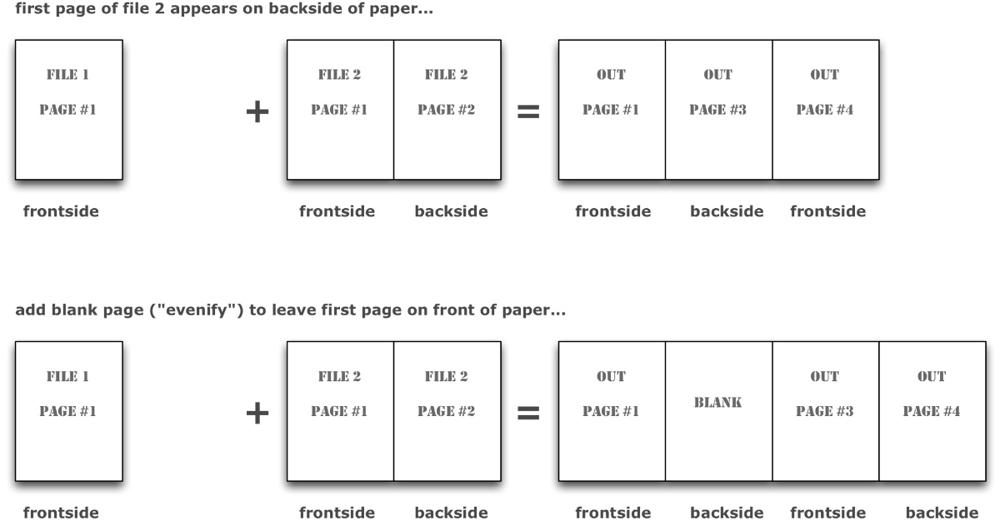

# Technical Documentation for PdfUtil 

### Contents

1. [Prerequisites - before you begin](#header_intro)
    * Tools and Plugins
    * Development Environment         
2. [Developer Guide](#header_developer)
	* Architecture Overview
	* Directory Layout 	
3. [Open Issues](#header_openissues)

## [Prerequsites](id:header_intro)

 

#### [Needed for Development](id:header_dependencies)

1. PdfUtils are developed in [Java][url_java] and therefore require a Java runtime for execution. If you don't know what that is, PdfUtil won't be the right tool for you.
2. Tests are implemented in [JUnit](url_junit) (version 4 with annotations), behaviour tests implemented in [SpockFramework](url_spock).
2. PdfUtils rely on a number of open-source libraries:
   a. The Pdf manipulation magic is done with [iTextPdf][url_itext] library, version 5 or later.
   b. Encryption (security) of Pdf, although implemented by [iTextPdf][url_itext], needs the famous [BouncyCastle][url_bouncycastle] crypto libraries.
   c. Command line argument parsing is performed by [JOpt-Simple][url_jopts].

Limitations: As the bouncycastle API changed so much, we have not implemented security functions (as we have not figured out which bc-versions works with our iText...) 

#### Used for Documentation
1. Any Markdown editor
2. OmniGraffle, a Mac-OS based graphic/drawing tool.

## Development Environment
I'm addicted to [IntelliJ IDEA][url_intellij] - a full-scale integrated development environment. It's a matter of taste, you should be able to work on PdfUtil using anything from Eclipse, NetBeans or any plain text editor.

 
 
 
---
## [Developer Guide](id:header_developer)

### Architecture Overview

#### Building Blocks

too simple to draw a diagram...

#### Runtime Scenarios
1. Analyse Command Line Options and their Arguments.
2. If required options are given, extract arguments from command line and transfer to PdfUtil instance attributes.
3. Dispatch depending on options given in the following order:
   a. help: explain all options on System.out
   b. concatenize
   c. add metadata
   d. add security / encryption to Pdf  

### Build with Gradle

Pdfutil can be build from IntelliJ or [Gradle][url_gradle]. 

### Directory Layout
    /doc  
    /lib: required libraries (see dependencies above)
    /src/main:  
    /src/test:
    /src/test/resources: some pdf files for testing
    

### Backend: Pdf Processing
T.B.D. (see iText manual for details)

#### Concatenating several Pdf files
* PdfCopy instance
* PdfReader
* PdfWriter

#### Adding blank pages (*evenify*)
##### Why add blank pages? What is evenification?
In book-like documents, content is printed on both front- and backside of pages. Numbering pages in books always starts with page #1 on the frontside of the first page.

In general, odd page numbers *always* appear on the right side, and are *always* on the frontside of pages.

This requirement leads to a slight issue when concatenating different Pdf files: If we want the first page of every file to appear on the right side of the final document, we need to add *filler* pages if the pagecount of the preceeding file is odd.

Sounds complicated? Look at an example.

###### All input files have EVEN pagecount

###### An input file with ODD pagecount

In this case, the FIRST page of the SECOND input file might be printed on the backside of a page. If this page is, for example, the start of a new chapter in a book, you need a blank page to the rescue…

PdfUtil has an option for this case, --e (for evenify) which defaults to true.

##### How blank pages are added
* itext.PdfCopy makes adding blank pages quite difficult.
* Generate a blank page in advance, with its own itext.PdfReader instance. 

### Command Line Parsing
The documentation of [JOpt][url_jopts] is based upon several small examples,
which explain the concepts in detail.

Terminology:

  * An *option* is preceeded by either `-` or `--` and might have *arguments*.
  * An *argument* is one or more pieces of additional information for *options*.
  
Example:

     pdfutil --t ./test/_out.pdf --e false --files ~/doc/chap1.pdf:~/doc/chap2.pdf
  
Here we have --t, --e and --f options, all with arguments.

#### Using JOpt
To use JOpt, one has to:
  
1. Define a jopt.Parser instance
2. Define allowed options on this parser 
3. Define a jopt.Options instance
4. call 
5. evaluate which options have been given and dispatch accordingly

### Testing

#### Unit tests

See test/org/arc42/*.java

#### Integration Tests
no yet committed

## [Open Issues](header_openissues)
* security functions not implemented yet (due to BouncyCastle API version issues)
* metadata cannot be added
* file separation character cannot be set

---
[url_java]: http://oracle.com/
[url_jopts]: http://pholser.github.com/jopt-simple/
[url_itext]: http://itextpdf.com "iText Pdf Library"
[url_spock]: http://www.spockframework.org "Spock Acceptance Test Framework"
[url_junit]: http://junit.org
[url_bouncycastle]: http://XXXXXX
[url_opengroup]: http://pubs.opengroup.org/onlinepubs/009695399/basedefs/xbd_chap12.html

[url_gradle]: http://www.gradle.org/docs/current/userguide/userguide.html
[url_compileOptions]: http://mrhaki.blogspot.de/2012/06/gradle-goodness-set-java-compiler.html

[url_intellij]: http://www.jetbrains.com/idea/