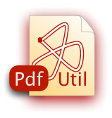

# User Guide

### Contents

1. [What is PdfUtil?](#header_intro)
   What you can do with it...
             
2. [Usage Examples](#header_examples)
	* Concatenate two pdf files
	* Encrypt a pdf file 
	* Add metadata to a pdf file	
	
3. [Command Reference](#header_reference)

4. [Free and Open Source](#header_free)

---
# [What is PdfUtil?](id:header_intro)
PdfUtil is a small utility by [arc42.org](arc42.org).

You use it via the provided shell script (.sh or .bat) or directly from the command line by executing the following:

    java -jar ./pdfutil-<version>.jar <options>
    

All commands are given to PdfUtil via command line [options and arguments](#header_reference).

You can use PdfUtil for the following tasks:

#### Concatenate
PdfUtil can concatenate (join together) a number of already existing Pdf files into a single Pdf. The original files are *never* modified, their (visible) content is completely preserved.

Hey - is there anything other than *visible content* in a Pdf? Yep - there might be metadata (like author, title, keywords) in the file. PdfUtil does NOT guarantee to preserve all of those information due to limitations of the underlying pdf processing library!

PdfUtil can solve the *even-page* problem (see below).

#### Evenify while concatenating
You want every chapter of your resulting document to start on odd pagenumbers (instead of mixing odd and even beginnings…)? Pdfutil can add blank pages at the end of input files, so the resulting document is *evenified*. Just add the -e flag.

With the -b option (shorthand for -blankpagetext), you can specify a text to be printed in large letters on the additional (otherwise blank) pages.

#### Encrypt (Secure Against Unauthorized Usage)
** NOT YET IMPLEMENTED **

Sometimes we deal with *secret* content which shall *NOT* be kept secret and private.
One possibility would be to keep such content out of digital representation,
don't store it on computers…. Another one is encryption - PdfUtil helps you with it.

PdfUtil can encrypt Pdf files so that only users with
* the *open-password* can open the file for reading.
* the *print-password* can print the file.
* the *ownwer-password* can alter its content or modify its security settings.

### Add Metadata
** NOT YET IMPLEMENTED **

* set author, subject, title, keywords

Limitation: The Pdf library we use (iText) does not allow to modify the producer-attribute
of Pdf files.

---
# [Usage Examples](id:header_examples)

### Concatenate Two or More Pdf Files

Concatenate s1.pdf and s2.pdf into outfile.pdf (note - files are separated by ":"
on Unix/Mac, should be replaced by ";" on Windows.

    pdfutil -f ./s1.pdf:./s2.pdf -t ./outfile.pdf
    
or, if you prefer to call java directly:

    java -jar ./pdfutil.jar -f ./s1.pdf:./s2.pdf -t ./outfile.pdf 

### Encrypt a Pdf File
TBD.

### Add Metadata to a Pdf File
TBD.

---
# [Command Reference](id:header_reference)
PdfUtil recognizes the following command line options and arguments:

Option  |  Argument(s)         | Meaning               | Alternative names 
:------- | :-------------------- | :--------------------- | :----------------- 
--f     | list of input files (separated by ",") | must be at least ONE Pdf file  | files, sourcefiles  
--t     | target-file          | name and path of output file | outfile
--?     |                      | help                  | help
--e     | true / false         | add blank pages to files with odd number of pages | -
--b     | text to print on blank pages | e.g. "intentionally left blank" |

(what a shame - MarkDown does not render tables well…)

#### --f (files, sourcefiles)
A comma separated list of input files.

Required - no input will produce no output.
 
No default.

#### --t (target, targetfile, outfile)
Name (and path) of file to be produced.

Default: `./pdfutil_out.pdf`

#### --e (evenify)
Add blank pages at the end of files with odd pagecount.

Default: `true`

#### --b (blank page text)
What text shall be printed on blank pages (added only if --e option is true).

Default: `Page intentionally left blank` 

---
# [Free and Open Source](id:header_free)
PdfUtil is free software - without ANY guarantee.

Use it on your own risk - don't blame us if it's not working, does not produce the desired results, or behaves somewhat strange:

    /************************************************************************
     * This is free software - without ANY guarantee!
     *
     *
     * Authored 2013 by Dr. Gernot Starke (arc42.org)
     *
     * Licensed under the Apache License, Version 2.0 (the "License");
     * you may not use this file except in compliance with the License.
     * You may obtain a copy of the License at
     *
     *   http://www.apache.org/licenses/LICENSE-2.0
     *
     * Unless required by applicable law or agreed to in writing, software
     * distributed under the License is distributed on an "AS IS" BASIS,
     * WITHOUT WARRANTIES OR CONDITIONS OF ANY KIND, either express or implied.
     * See the License for the specific language governing permissions and
     * limitations under the License.
     ************************************************************************/

[url_arc42]: http://arc42.org/
[url_pdfutil]: http://arc42.bitbucket.com/
[url_itext]: http://itextpdf.com "iText Pdf Library"

[url_intellij]: http://www.jetbrains.com/idea/